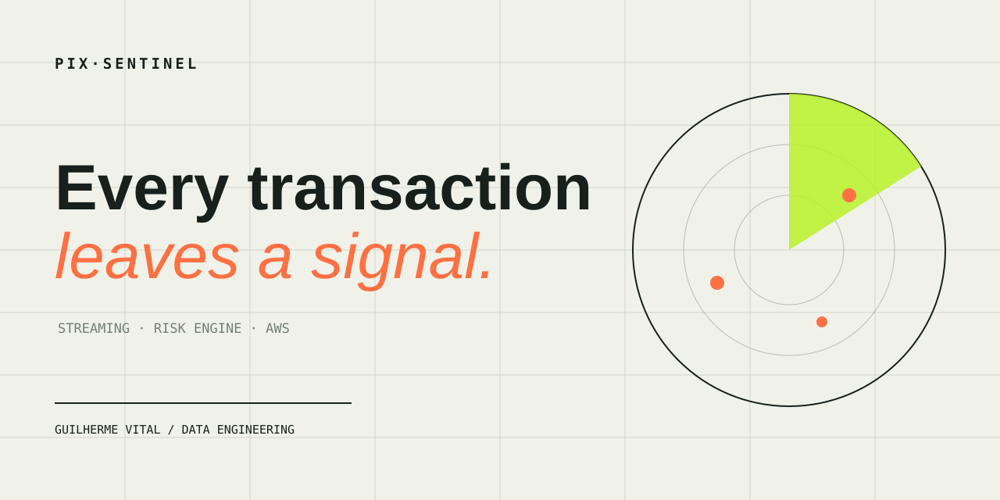
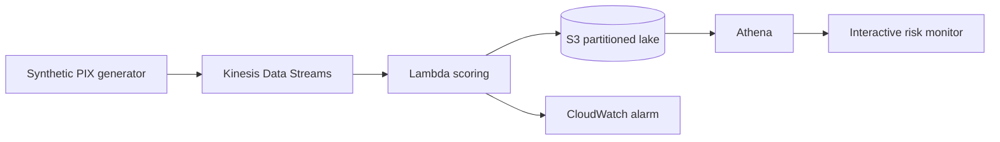

<p align="center">
  
</p>

<p align="center">
  
  
  
  
</p>

<p align="center"><strong>An explainable, event-driven risk pipeline for synthetic PIX transactions.</strong></p>

<p align="center">
  <a href="https://guivital1.github.io/pix-sentinel/"><strong>Explore the live risk monitor →</strong></a>
</p>

## What happens inside

PIX Sentinel simulates legitimate and suspicious payment behavior, scores each event with an explainable risk model, and turns the result into analytical evidence. It is designed to demonstrate streaming data engineering without exposing or imitating any real customer data.



| Signal | Why it matters | Weight |
| --- | --- | ---: |
| Very high amount | Unusual transaction value | 35 |
| Extreme velocity | Many transactions in one hour | 30 |
| New device | Recently unseen access context | 18 |
| New account | Limited behavioral history | 12 |
| Unusual hour | Activity between midnight and 05:00 UTC | 10 |

Scores are capped at 100. Every alert retains the contributing signals, making the decision auditable instead of presenting a black-box prediction.

## Run it locally

```bash
python3 -m venv .venv
source .venv/bin/activate
python -m pip install -e '.[dev]'
pix-sentinel --count 500
./scripts/serve_dashboard.sh
```

Open [http://localhost:8000](http://localhost:8000). The same random seed always produces the same dataset, so tests and screenshots remain reproducible.

```bash
pytest
ruff check src tests
```

## Deploy a controlled AWS demo

The schedule is **disabled by default**. A deployment creates one provisioned Kinesis shard, two small ARM Lambda functions, an encrypted S3 bucket with 30-day expiration, and a CloudWatch error alarm.

```bash
sam build
sam deploy --guided
```

For a short demonstration, explicitly enable generation and disable it immediately afterwards:

```bash
sam deploy --parameter-overrides EnableSimulation=true AlertEmail=you@example.com
# collect evidence, then stop new events
sam deploy --parameter-overrides EnableSimulation=false AlertEmail=you@example.com
```

See the [deployment runbook](docs/deployment.md), [cost guardrails](docs/cost-safety.md), and [Athena query](infra/athena.sql) before deploying.

## Repository map

```text
src/pix_sentinel/  generator, risk model, pipeline and Lambda handlers
template.yaml      cost-controlled AWS SAM infrastructure
infra/             Athena schema and portfolio query
docs/              interactive dashboard and technical notes
tests/             deterministic unit and infrastructure tests
```

## Engineering decisions

- **Synthetic by design:** no personal, banking, or production data.
- **Explainable first:** risk reasons are stored beside every score.
- **Cost-aware:** scheduled traffic defaults to off; data expires after 30 days.
- **Reproducible:** fixed seeds, infrastructure as code, CI tests, and documented queries.
- **Portfolio-safe:** the public dashboard contains only generated examples.

## Status

- [x] Deterministic event generator
- [x] Explainable scoring model
- [x] Local end-to-end simulation
- [x] Interactive dashboard
- [x] Kinesis → Lambda → S3 infrastructure
- [x] Tests and CI/CD
- [ ] Controlled AWS deployment and evidence
- [ ] SageMaker anomaly-model experiment
- [ ] Parquet curation with AWS Glue

This project is educational. A risk score is a simulation, not a production fraud decision.

<p align="center"><sub>Built by <a href="https://github.com/guivital1">Guilherme Vital</a> · Data Engineering · Machine Learning · AWS</sub></p>

